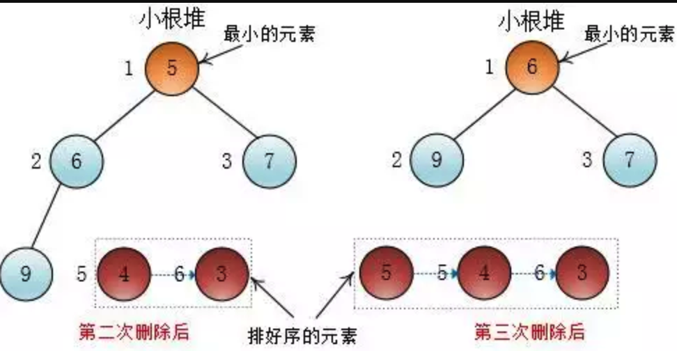

## 图解堆排序

堆排是基于堆的一种排序算法，这篇文章主要讲解堆排的思想，复杂度以及稳定性

### 一、堆排思想

示例讲解：对一个无序数组（如下图），给它排好序


如果将这个数组调整为小根堆，那么根据小根堆堆顶一直是最小元素的特性，可以不断地取（删除）堆顶的元素，直到堆中只剩下一个元素，这样就可以得到一个递减的元素序列了

删除中交换操作会破坏堆有序，但下沉操作会重新调整堆

__用一个图解来说明__

__第一次删除堆最小元素__


__变成最小根堆后__


__第二次删除堆最小元素__



__变成最小根堆后__


这样一直删除到只有一个元素的时候，整个数组就排好序了

删除包括三个步骤：

    * 交换堆顶与堆最后一个元素
    * 堆大小(heapSize)减一
    * 调整堆(sink(arr,1)) 

刚才是建立在数组是小根堆的情况下进行的，那如何将无序数组调整成堆呢？

#### 建堆

遍历数组中的每个元素，给一个空堆不断插入元素，直到插完所有元素，这样就可以构造一个堆

__上浮(swim)操作会保持堆有序__


这确实是一种方法，但更常见的是用下沉(sink)操作自底向上构造一个堆

__下沉（sink）__


每个叶子节点可以视为一个大小为一的堆，我们可以自底向上从非叶子节点开始每层从右至左给每个节点都调用下沉(sink)方法，这样以当前节点为根节点的树就变为堆了


然后给左边的节点4执行下沉(sink)操作（同一层从右向左）


最后根节点执行下沉(sink)操作


这样整个完全二叉树就变成了一个最小堆，注意：在下沉(sink)某个节点的时候，这个节点的两个孩子必须是堆

### 二、堆排代码

#### 2.1、建堆和删除最小值的代码

```js

/**
 * 将传进来的数组变成小根堆
 * @param arr a[1...n]为有效元素，a[0]为无效元素
 */
public void buildHeap() {
    // 从第一个非叶子节点开始sink调整，也就是堆大小的一半处
    for (int i = heapSize / 2; i >= 1; i--) {
        sink(arr, i); // 调整以节点i为父节点的树为堆（符合堆有序）
    }
}

```

这里的 heapSize/2 就是第一个非叶子节点的下标


__删除最小值的代码__

```js

/**
 * 删除堆中最小的元素（通过heapSize-- 逻辑上删除）
 * @param arr arr[1...n]为有效元素
 */
private void deleteMin(int [] arr) {
    swap(arr, 1, heapSize); // 交换堆顶和堆最后一个元素
    heapSize--;
    sink(arr, 1); // 调整使之重新变成堆有序
}

```

排序的代码：按照之前的思路，先建立一个小根堆，然后不断地删除堆顶最小元素，删除N-1次就OK了

```js

/**
 * 对给定数组arr排序，使之为降序
 * @param arr arr[1...n]为有效元素，arr[0]为元素无效
 */
public void heapSort(int [] arr) {
    int N = arr.length - 1;
    buildHeap(arr); // 建小根堆
    // N个元素的小根堆，排序（删除堆顶）N - 1次，数组就变成降序了
    for (int i = 1; i <= N - 1; i++) {
        deleteMin(arr); // 删除arr数组中最小的值
    }
}

```

只需删除N-1次，剩下的那个自然是最大的，所以循环N-1次，这个排序就是堆排序

### 三、时间复杂度

堆排的整个过程，第一步建堆，第二步执行N-1次deleteMin()方法,最后取两者复杂度较高的

#### 3.1 建堆时间复杂度

建堆的时候时间消耗在下沉操作上，而下沉操作最多下沉到底，显然，高度为h的节点下沉代价为O(h)


堆中所有元素下沉代价之和就是建堆的代价（时间复杂度）。叶子节点高度为0，下沉代价为0

把堆中不同高度中的所有节点相加起来就是全部的节点

所以问题变为：

    * 高度最高多高（高度上界）
    * 高度h有多少节点


这里我们把不同高度的每个节点执行sink所需要的代价累加起来，


公式推导：


结论：建堆的时间复杂度为O(n)

#### 3.2 N-1次删除复杂度

n-1次调用deleteMin

deleteMin中包含 swap操作和 sink操作

swap操作代价为常数，sink操作代价为lgn,swap操作相对于sink操作可以忽略不计

则相当于进行了n-1次sink操作

则一共花费的代价为：(n-1)*lgn ~ nlgn

故时间复杂度为O(nlgn)


两个步骤相加的复杂度为：O(n)+O(nlgn)，O(nlgn)复杂度高于O(n)，所以堆排序的时间复杂度为O(nlgn)

### 四、稳定性

__堆排序是不是稳定的？__

不是稳定的，就拿5,7,13,5，这个序列来说吧，用大根堆的结构排序,排序前后两个5的位置会发生变化


初始状态的5的先后顺序和排完序的顺序明显不一样了（黄色5跑到红色5左边去了），所以这个排序不是稳定的


本文转载并解读
原文地址：[图解堆排序](https://mp.weixin.qq.com/s/u0R1OriNbMT6MX5OCdRG9Q)

